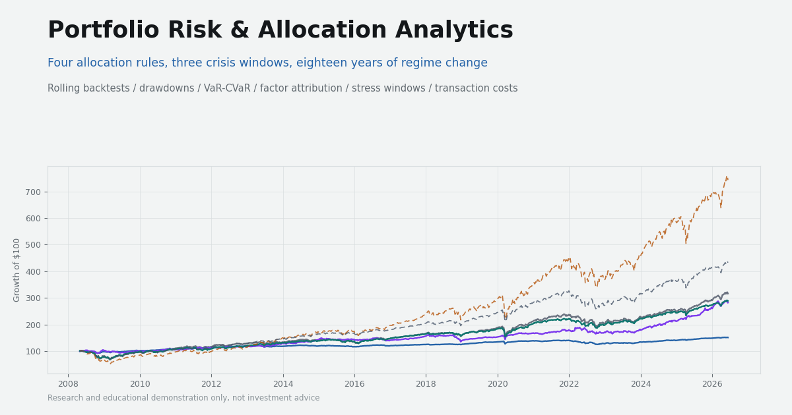

# Portfolio Risk & Allocation Analytics

A multi-asset portfolio research dashboard comparing allocation strategies across
optimization objectives, regime signals, factor exposures, transaction costs,
drawdowns, and crisis periods.



## What it does

The project evaluates how four allocation strategies behave when risk estimates,
market regimes, and implementation constraints change:

| Strategy | Type | Core idea |
| --- | --- | --- |
| Equal Weight | Baseline | 1/N across the universe — no estimation |
| Global Minimum Variance | Optimized | Minimize estimated variance (covariance only) |
| Max Sharpe / Risk-Adjusted Return | Optimized | Maximize estimated excess return per unit of risk |
| Regime-Aware Allocation | Rule-based | Growth/defensive sleeves driven by correlation, CPI, and VIX stress signals |

All strategies share one playing field: a 13-ETF multi-asset universe, monthly
rebalancing, 6M / 1Y / 3Y estimation lookbacks, long-only weights with a 35%
per-asset cap, 5 bps transaction cost per unit turnover, and strict no-look-ahead
rules (CPI is additionally lagged one month). Benchmarks are SPY and a monthly
rebalanced 60/40 (SPY/IEF).

Evaluation covers cumulative wealth, drawdowns, VaR/CVaR, Sortino, skew/kurtosis,
turnover, concentration, transaction-cost drag, Fama-French 5-factor exposure
diagnostics, and dedicated crisis windows (2008–09 GFC, 2020 COVID shock,
2022 inflation / rate-hike drawdown).

## Architecture

```
research/   Python research engine — downloads data, runs backtests,
            computes analytics, validates, exports JSON
data/       Generated frontend-ready JSON (every number on the site
            is traceable to a file here)
app/        Next.js App Router entry
components/ Dashboard sections (server components + client chart islands)
lib/        Typed data loaders, formatters, chart utilities
```

The frontend never computes finance logic. Python generates the analytics;
React presents them.

## Running the research engine

```bash
cd research
python3 -m venv .venv
source .venv/bin/activate
pip install -r requirements.txt
python generate_outputs.py          # regenerates everything in data/
```

One command regenerates all frontend data. Raw downloads are cached in
`data/raw/`; pass `--force-download` to refresh. The run ends with a validation
summary (weight sums, bounds, look-ahead checks, VaR/CVaR conventions, CPI lag,
benchmark construction, export completeness) written to
`data/validation-summary.json`.

## Running the frontend

```bash
npm install
npm run dev     # http://localhost:3000
npm run build   # production build (static)
```

## Data sources

- **ETF prices** — Yahoo Finance via `yfinance`, adjusted close
- **VIX** — Yahoo Finance `^VIX` (Cboe index; signal only, never investable)
- **CPI** — FRED `CPIAUCSL`, lagged one month in the backtest
- **Factors** — Kenneth French Data Library, 5-factor daily
- **Market context** — AQR, FRED, Cboe, J.P. Morgan Asset Management, Kenneth
  French Data Library (cited on the site)

## Methodology conventions

- **Data ranges.** Raw prices are downloaded from 2006-01-01, but the valid
  backtest range begins where every investable ETF has return data
  (April 2007 — SHV inception 2007-01, HYG inception 2007-04). Each lookback's
  backtest then starts once a full estimation window exists, so longer
  lookbacks begin later.
- **Benchmark construction.** SPY benchmark = 100% SPY buy-and-hold;
  60/40 = 60% SPY / 40% IEF rebalanced monthly; Equal Weight (also Strategy 1)
  = 1/13 across the investable universe, rebalanced monthly. Benchmarks are
  net of the same turnover cost model where rebalancing applies; the 100% SPY
  benchmark has no ongoing rebalancing turnover, so its cumulative cost drag is 0.00%.
- **Rebalancing and drift.** Decisions occur at month-end close `t` using data
  through `t-1` only; new weights earn returns from `t+1` and drift with daily
  returns until the next rebalance.
- **Turnover and costs.** Turnover = `sum(|target − drifted pre-trade weights|)`;
  cost = 5 bps × turnover. The initial cash buy-in is excluded from costs and
  turnover statistics so ongoing cumulative cost drag is comparable across series. Equal
  Weight therefore shows realistic nonzero turnover (drift), and Max Sharpe's
  high turnover reflects noisy sample expected returns — deliberately exposed,
  not hidden.
- **CPI lag.** The CPI YoY signal is lagged one month so no rebalance uses a
  print before its public release.
- **Risk-free conventions.** SHV (annualized over the lookback) is the
  optimizer's investable cash proxy; the daily Fama-French RF is used for
  standardized Sharpe reporting. Two conventions, each fit for purpose.
- **Annualization.** Annualized returns are geometric annualized returns from
  daily net returns: `(1 + cumulative)^(252/T) − 1`. Annualized volatility is
  daily volatility × √252. Sharpe uses daily excess returns × √252; Sortino
  uses downside deviation relative to a zero daily return threshold.
- **VaR/CVaR sign convention.** VaR and CVaR are daily historical loss
  estimates at the 95% confidence level, reported as **positive loss
  magnitudes** (CVaR ≥ VaR by construction, enforced by validation). Drawdowns
  are reported as negative values.
- **Factor model limitation.** The Fama-French 5-factor regression is an
  equity-factor exposure diagnostic. It does not fully explain multi-asset
  strategies holding bonds, TIPS, gold, commodities, credit, REITs, and cash;
  a fuller attribution would add term, credit, inflation, commodity, and
  real-asset factors. Intercepts are residual returns under this limited
  model — not proof of alpha.
- **Honest data boundaries.** The 2008 GFC window is fully covered only at the
  6M lookback. For like-for-like comparison, benchmarks are aligned to the
  common strategy sample, so they too are marked `insufficient_data` where the
  aligned window is incomplete — values are never interpolated. This is
  surfaced as a documented validation warning.

## Limitations

Historical performance does not predict future returns. ETF proxies are
imperfect; expected-return and covariance estimates are noisy; the cost model is
a simplified linear approximation; taxes, spreads, and market impact are
ignored; regime thresholds are judgment calls; factor regressions diagnose
exposures and are not proof of alpha; crisis windows are manually selected.

## Disclaimer

This project is for research and educational demonstration only. It is not
investment advice and does not recommend any portfolio, ETF, security, or
trading strategy.
