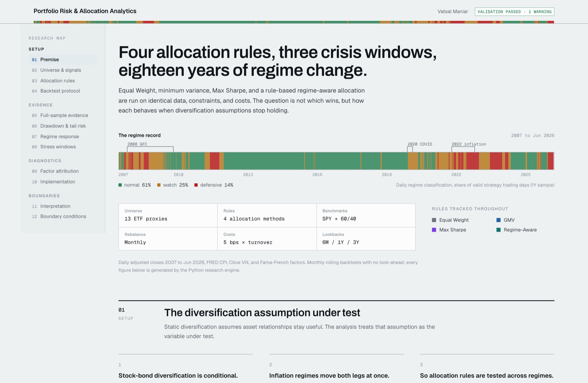
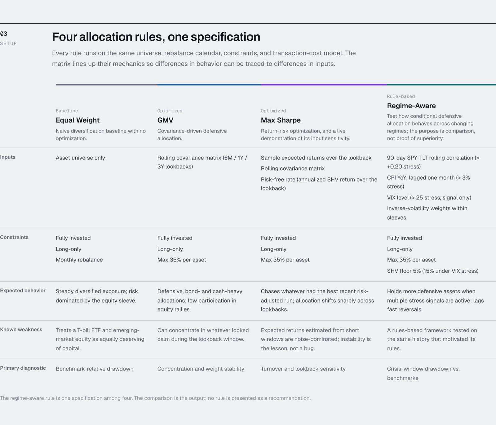
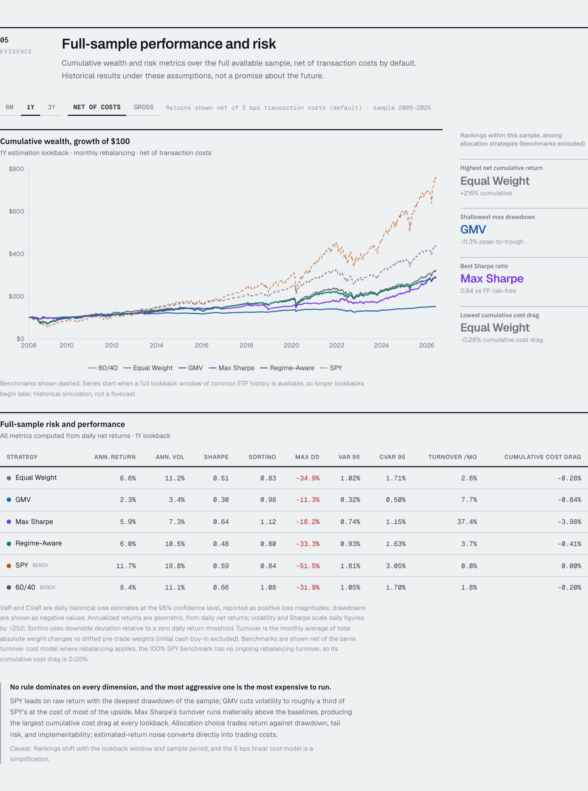
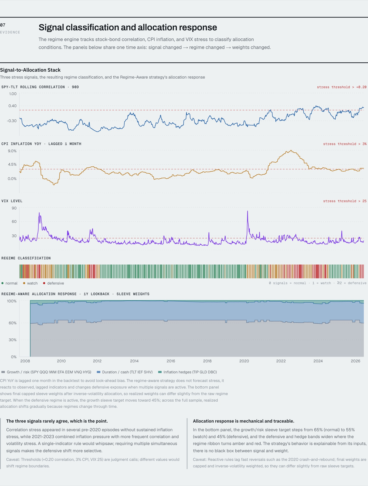
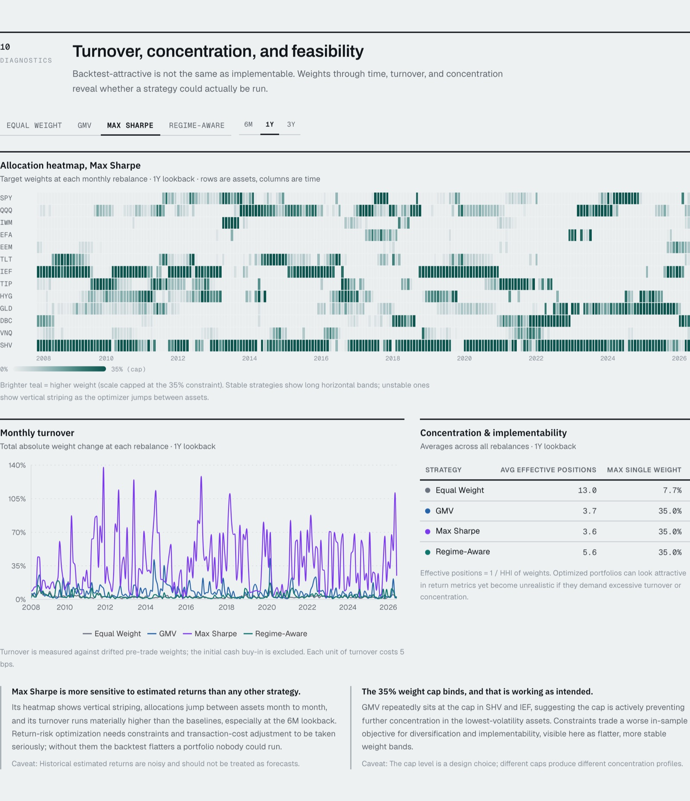

# Portfolio Risk & Allocation Analytics

An interactive research interface comparing four multi-asset allocation rules across
rolling estimates, regime signals, factor exposure, drawdowns, transaction costs, and
crisis windows. A Python research engine generates validated analytics; a Next.js
interface presents them. Every number on the page is traceable to a generated data file.

**Repo:** https://github.com/VM25/portfolio-lab



## What this is

The central question is not which allocation rule wins, but how each behaves when the
diversification assumptions it relies on stop holding. Four rules are run on identical
data, constraints, and costs:

| Rule | Type | Core idea |
| --- | --- | --- |
| Equal Weight | Baseline | 1/N across the universe, no estimation |
| Global Minimum Variance | Optimized | Minimize estimated variance (covariance only) |
| Max Sharpe / Risk-Adjusted Return | Optimized | Maximize estimated excess return per unit of risk |
| Regime-Aware Allocation | Rule-based | Growth and defensive sleeves driven by correlation, CPI, and VIX stress signals |

All four share one specification: a 13-ETF multi-asset universe, monthly rebalancing,
6M / 1Y / 3Y estimation lookbacks, long-only weights with a 35% per-asset cap, 5 bps
transaction cost per unit turnover, and strict no-look-ahead rules (CPI is additionally
lagged one month). Benchmarks are SPY and a monthly-rebalanced 60/40 (SPY/IEF).

Evaluation spans cumulative wealth, drawdowns, VaR/CVaR, Sortino, skew/kurtosis,
turnover, concentration, cumulative cost drag, Fama-French 5-factor exposure
diagnostics, and three dedicated crisis windows (2008-09 GFC, 2020 COVID shock,
2022 inflation / rate-hike drawdown).

## The interface

The page reads as a sequence of analytical modules, navigated by a scroll-tracked
research map. The daily regime classification (normal / watch / defensive) is the
recurring identity element, running across the masthead and opening the page as a
colored record with the three studied crisis windows bracketed.

**Allocation rules as one specification matrix** — mechanics line up side by side so
behavioral differences trace back to differences in inputs.



**Full-sample evidence** — cumulative wealth (growth of $100), a ranking rail, and the
risk/performance table, with a lookback selector and a gross/net toggle.



**Signal-to-allocation stack** — the signature exhibit. Three stress signals, the
resulting regime classification, and the Regime-Aware rule's sleeve weights share one
time axis: signal changed, regime changed, weights changed.



**Implementation diagnostics** — an allocation-weight heatmap through time, monthly
turnover, and concentration, answering whether a backtest-attractive rule is actually
runnable.



## Tech stack

- **Research engine:** Python (pandas, NumPy, SciPy, cvxpy, statsmodels), `yfinance` for prices.
- **Interface:** Next.js 15 (App Router, React 19, TypeScript), Tailwind CSS v4, Recharts.
- **Type:** Archivo (headings), IBM Plex Sans (subheadings), Geist Sans (body), Geist Mono (data).
- **Data flow:** the frontend imports static generated JSON. No finance logic runs in React.

## Repository layout

```
research/    Python research engine: data loading, signals, estimators, optimizers,
             strategies, backtest, metrics, crisis, factors, diagnostics, validation,
             and export. generate_outputs.py runs the whole pipeline.
data/        Generated frontend-ready JSON (+ raw/processed caches for reproducibility).
app/         Next.js App Router entry, layout, and global theme tokens.
components/  Research-interface modules (server components + client chart islands).
lib/         Typed data loaders, formatters, chart utilities, the research-flow map.
scripts/     sanity_audit.py: nine deployment checks over the generated data files.
screenshots/ Interface screenshots used in this README.
```

## Running it

**Research engine** (regenerates everything in `data/`):

```bash
cd research
python3 -m venv .venv
source .venv/bin/activate
pip install -r requirements.txt
python generate_outputs.py            # raw downloads are cached; --force-download to refresh
```

The run ends with a validation summary (weight sums, bounds, no-look-ahead, VaR/CVaR
conventions, CPI lag, benchmark construction, export completeness) written to
`data/validation-summary.json`.

**Interface:**

```bash
npm install
npm run dev      # http://localhost:3000
npm run build    # production build
```

**Numerical sanity audit** (verifies the generated data, not hardcoded values):

```bash
research/.venv/bin/python scripts/sanity_audit.py
```

It checks weights sum to 1 and respect the 35% cap, signal series are never held,
the CPI signal is lagged with no look-ahead, turnover excludes the initial buy-in,
cumulative cost drag equals the terminal net/gross wealth ratio, VaR/CVaR are positive
loss magnitudes while drawdowns are negative, SPY carries zero cost drag, and the 2008
insufficient-data logic is consistent across lookbacks, strategies, and benchmarks.

## Data sources

- **ETF prices** — Yahoo Finance via `yfinance`, adjusted close.
- **VIX** — Yahoo Finance `^VIX` (Cboe index; signal only, never investable).
- **CPI** — FRED `CPIAUCSL`, lagged one month in the backtest.
- **Factors** — Kenneth French Data Library, 5-factor daily.
- **Market context** — AQR, FRED, Cboe, J.P. Morgan Asset Management, and the Kenneth
  French Data Library, cited on the page with calculation provenance noted per source.

## Methodology conventions

- **Data ranges.** Raw prices download from 2006-01-01, but the valid backtest range
  begins where every investable ETF has return data (April 2007; SHV inception 2007-01,
  HYG inception 2007-04). Each lookback then starts once a full estimation window exists,
  so longer lookbacks begin later.
- **Benchmark construction.** SPY = 100% SPY buy-and-hold; 60/40 = 60% SPY / 40% IEF
  rebalanced monthly; Equal Weight = 1/13 across the universe, rebalanced monthly.
  Benchmarks are net of the same turnover cost model where rebalancing applies; the
  100% SPY benchmark has no ongoing rebalancing turnover, so its cumulative cost drag
  is 0.00%.
- **Rebalancing and drift.** Decisions occur at month-end close `t` using data through
  `t-1` only; new weights earn returns from `t+1` and drift with daily returns until the
  next rebalance.
- **Turnover and costs.** Turnover = `sum(|target - drifted pre-trade weights|)`;
  cost = 5 bps x turnover. The initial cash buy-in is excluded from costs and turnover
  statistics, so ongoing cumulative cost drag is comparable across series. Equal Weight
  therefore shows realistic nonzero turnover (drift), and Max Sharpe's high turnover
  reflects noisy sample expected returns, deliberately exposed rather than hidden.
- **CPI lag.** The CPI YoY signal is lagged one month so no rebalance uses a print
  before its public release.
- **Risk-free conventions.** SHV (annualized over the lookback) is the optimizer's
  investable cash proxy; the daily Fama-French RF is used for standardized Sharpe
  reporting.
- **Annualization.** Geometric annualized returns from daily net returns:
  `(1 + cumulative)^(252/T) - 1`. Annualized volatility is daily volatility x sqrt(252).
  Sharpe uses daily excess returns x sqrt(252); Sortino uses downside deviation relative
  to a zero daily return threshold.
- **VaR/CVaR sign convention.** Daily historical loss estimates at the 95% confidence
  level, reported as positive loss magnitudes (CVaR >= VaR by construction, enforced by
  validation). Drawdowns are reported as negative values.
- **Factor model limitation.** The Fama-French 5-factor regression is an equity-factor
  exposure diagnostic. It does not fully explain multi-asset strategies holding bonds,
  TIPS, gold, commodities, credit, REITs, and cash; a fuller attribution would add term,
  credit, inflation, commodity, and real-asset factors. Intercepts are residual returns
  under this limited model, not proof of alpha.
- **Honest data boundaries.** The 2008 GFC window is fully covered only at the 6M
  lookback. For like-for-like comparison, benchmarks are aligned to the common strategy
  sample, so they too are marked `insufficient_data` where the aligned window is
  incomplete; values are never interpolated. This is surfaced as a documented validation
  warning.

## Limitations

Historical performance does not predict future returns. ETF proxies are imperfect;
expected-return and covariance estimates are noisy; the cost model is a simplified linear
approximation; taxes, spreads, and market impact are ignored; regime thresholds are
judgment calls; factor regressions diagnose exposures and are not proof of alpha; crisis
windows are manually selected.

## Disclaimer

This analysis is for research and educational demonstration only. It is not investment
advice and does not recommend any portfolio, ETF, security, or trading strategy.
Historical performance does not predict future results.
